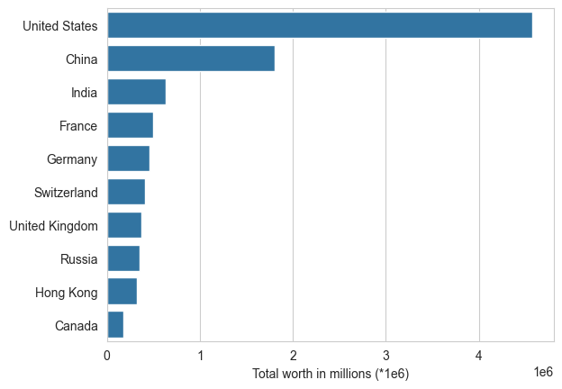

# Analysis of the billionaires data 

Dataset is taken from kaggle: https://www.kaggle.com/datasets/nelgiriyewithana/billionaires-statistics-dataset

The idea is to carry out exploratory data analysis and then try to build a regression model attempting to predict
billionaire's wealth based on certain factors 

### Major takeaways

(Assuming the data from the dataset comes from a trustworthy source)

* There are several billionaires which are significantly wealthier than other (i.e. outliers) as we can see from the
boxplot

* Here's the same box plot with values transformed to log2(finalWorth)

* The 10 wealthiest billionaires would be

* The majority of billionaires come from these countries

* From the following boxplot we can see that self-made billionaires earn less (although proper statistical test is required)

* And the majority of wealth is distributed in this way

* The majority of billionaires are around 65 years old with 50% falling
into the range between 56 and 75

* And the birth year is around 1960, respectively

